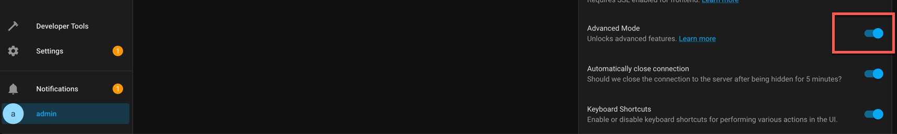
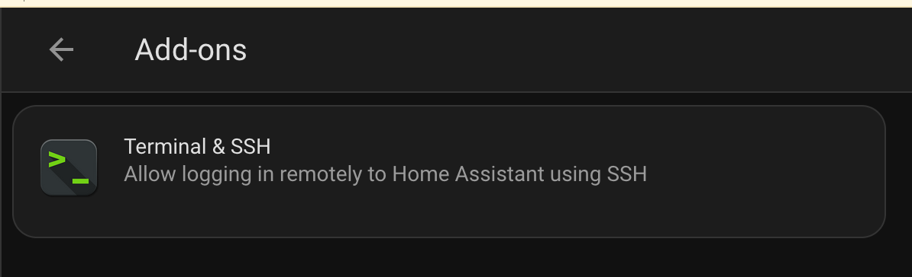
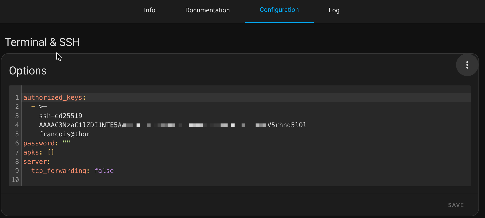
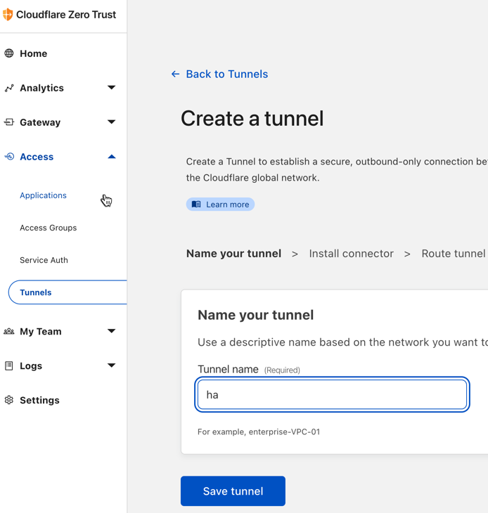
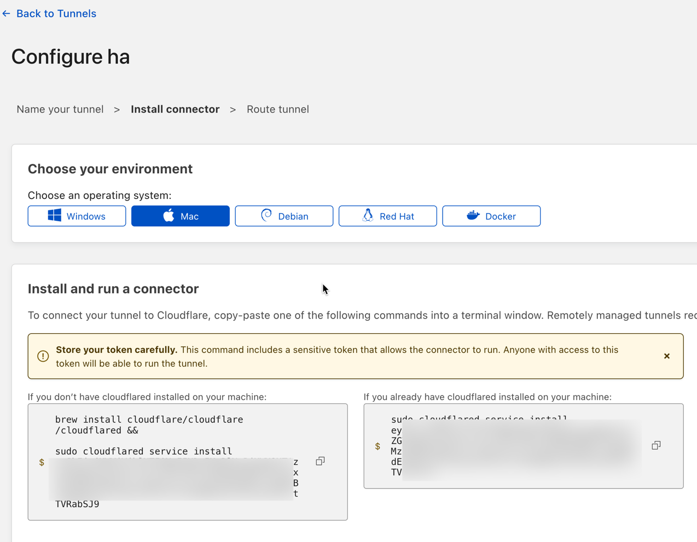
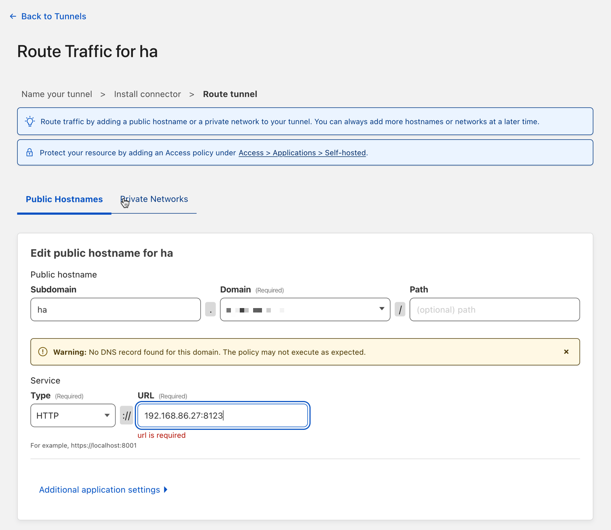
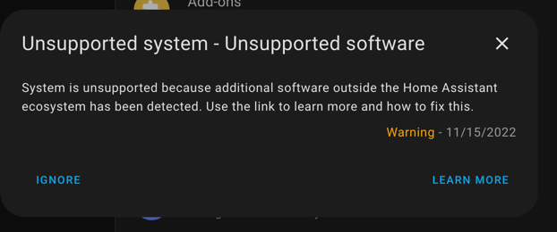

# Install Home Assistant (HA OS) with cloudflared 

## Install HA

https://www.home-assistant.io/installation

Consider installation on raspberry 4

Get the image 

```
https://github.com/home-assistant/operating-system/releases/download/9.3/haos_rpi4-64-9.3.img.xz
```

Flash SD Card with Balena Etcher 

Boot the Raspberry with the SD Card and approx 15 minutes later, you shoud have the prompt to set initial user/password

```
http://homeassistant.local:8123
```

> Name of home-assistant can varry depending of network configuration, in my case mDNS was configured on router, so I can access via name. Otherwise just get the ip address

## SSH

- Select advanced mode in user profil

- Install SSH add-on

- Create SSH key if doesn't exist
  ```
   ssh-keygen -t ed25519
  ```

- SSH

  #### Container access

  

  Start add-on then you can access via ssh

  ```
  ssh root@homeassistant.local
  ```

  ```t
  
  | |  | |                          /\           (_)   | |            | |
  | |__| | ___  _ __ ___   ___     /  \   ___ ___ _ ___| |_ __ _ _ __ | |_
  |  __  |/ _ \| '_ \ _ \ / _ \   / /\ \ / __/ __| / __| __/ _\ | '_ \| __|
  | |  | | (_) | | | | | |  __/  / ____ \\__ \__ \ \__ \ || (_| | | | | |_
  |_|  |_|\___/|_| |_| |_|\___| /_/    \_\___/___/_|___/\__\__,_|_| |_|\__|
  
  Welcome to the Home Assistant command line.
  
  System information
    IPv4 addresses for eth0:
    IPv4 addresses for wlan0: 192.168.86.27/24
    IPv6 addresses for wlan0: fe80::1159:4ca2:f3ae:ded0/64
  
    OS Version:               Home Assistant OS 9.3
    Home Assistant Core:      2022.11.2
  
    Home Assistant URL:       http://homeassistant.local:8123
    Observer URL:             http://homeassistant.local:4357
  ```

  

  

  #### OS access

  https://developers.home-assistant.io/docs/operating-system/debugging/

  Create USB drive formatted with authorized_keys in root directory, then put the same key used in previous step

  

  from home-assistant configured in previo

  ```
   ha os import
  ```


  You should be able to access now OS side

  ```
  ssh root@homeassistant.local -p 22222
  Welcome to Home Assistant OS.
  Use `ha` to access the Home Assistant CLI.
  #
  
  ```


- Cloudflare
  
  create tunnel
  
  
  
  
  

  add cloudflared container from home assistant os port 22222
  
  ```
  docker run  -d  --restart always --name cf  cloudflare/cloudflared:2022.10.3   tunnel run --token ey....
  ```
  
  > Use jwt token create before

- Home assistant

  Modify config/configuration.yaml to integrate trusted_proxies and use_x_forwarded_for

  ```
  
  | |  | |                          /\           (_)   | |            | |
  | |__| | ___  _ __ ___   ___     /  \   ___ ___ _ ___| |_ __ _ _ __ | |_
  |  __  |/ _ \| '_ \ _ \ / _ \   / /\ \ / __/ __| / __| __/ _\ | '_ \| __|
  | |  | | (_) | | | | | |  __/  / ____ \\__ \__ \ \__ \ || (_| | | | | |_
  |_|  |_|\___/|_| |_| |_|\___| /_/    \_\___/___/_|___/\__\__,_|_| |_|\__|
  
  Welcome to the Home Assistant command line.
  
  System information
    IPv4 addresses for eth0:
    IPv4 addresses for wlan0: 192.168.86.27/24
    IPv6 addresses for wlan0: fe80::1159:4ca2:f3ae:ded0/64
  
    OS Version:               Home Assistant OS 9.3
    Home Assistant Core:      2022.11.2
  
    Home Assistant URL:       http://homeassistant.local:8123
    Observer URL:             http://homeassistant.local:4357
  ```

  ```
  vi config/configuration.yaml
  ```

  ```
  
  # Loads default set of integrations. Do not remove.
  default_config:
  
  # Load frontend themes from the themes folder
  frontend:
    themes: !include_dir_merge_named themes
  
  # Text to speech
  tts:
    - platform: google_translate
  
  automation: !include automations.yaml
  script: !include scripts.yaml
  scene: !include scenes.yaml
  http:
    base_url: https://ha.coco.network
    use_x_forwarded_for: true
    trusted_proxies:
      - 172.17.0.2
  
  ```

- Troubleshoot

  As a new container is installed in Hassio Ecosystem, supervisor complains about it, you can just ignore.
  
  
  